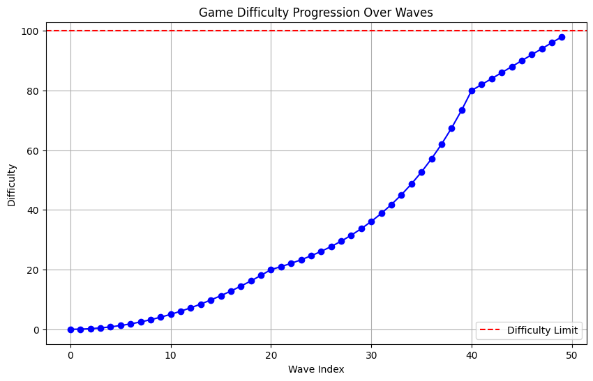

# spawner 出怪

由于在0.0.2和0.0.3开发前期,采用的是固定出怪表,人力设计不合理而且难以维护新的出怪表

因此参考以下两篇文章给出新的spawner机制

[技术:出怪机制 - PVZ Wiki](https://wiki.pvz1.com/doku.php?id=技术:出怪机制)

[【PVZ】复合出怪 - 哔哩哔哩](https://www.bilibili.com/opus/758753445344706600?spm_id_from=333.1387.0.0)

利用新的机制制作出怪表自动机,利用自动机批量写出怪表.

>  可以理解为预制菜,而非真的每局随机生成

---

对于一次出怪表生产流程,你会获得相当于原`ch*.json`中的waves字段,因此.仍然需要手动填写`rows`,`type`,`onWin`,`energy`,`rewards` 这些和出怪无关的字段

以下理论中的诸如`flag`,`wave`概念如果为指明,那么含义和植物大战僵尸一样,即一个flag是旗帜,两个flag之间是若干wave波

### 输入参数

- 起始`waveID`:这个是`stageData`的概念,会影响生成json中`waveID`的开始序号,默认为0,和出怪机制无关 

- 起始难度,终点难度,难度

  - $$
    [0,+\infty]
    $$

- 水路row:  (如ch5的2,3), 这里注意从上到下依次为 {0,1,2,3,4,5,6} ,这个字段会影响小**波数序号**的波数(0,1,2)中,水路row是否会在`exceptLine[]`(即开局几波不在水路刷怪),你可以自行在生成的文件中把这个限制删除

- flag次数(默认为1).

  - 例如,此值为2时,从视觉上看,一开始都是平平无奇的出怪,中间来了一波大的,接着又平平无奇的刷怪,最后又来了一波大的,本局游戏结束

- `Map(flag : int, waveNum : int)`, 每一flag之后会有多少wave(计算旗帜波)

  - 例如,上述为2的情况下,我要设计的流程`准备,刷1只,刷4只,刷10只,一波大的flag,刷15只,刷16只,一波大的flag`,(这里数值仅参考),那么类似如下

  - ```python
    {
        0: 4,
        1: 3,
        2: 1
    }
    ```

- `waveNum: int[]` x阶僵尸多少Wave可出,注释仅提供难度参考

  - ```python
    {
        0: 0, # 0阶僵尸0波可出,普僵、路障、铁桶、读报、雪人
        1: 3,  # 1阶僵尸3波可出,撑杆、铁门、橄榄、舞王
        2: ..., # 潜水、冰车、小丑、气球、矿工、跳跳、梯子、投篮
        3: ... # 白眼、红眼
    }
    ```

## 理论

### 某wave级别总和(加权和)不超过某wave的级别上限, 影响 `monsters[]`


当前wave序号 - widx
$$
(\text{widx} \cdot 0.4) + 1
$$

### 刷新时间,影响minDelay和maxDelay

### 不再生成普通僵尸等低难度高权重

从一定的波数起,开始每wave减少权重,直到到某固定值


### 示例

#### 初始模型

- 前期: 二次函数增长，让玩家有足够的时间适应游戏机制。 

- 中期: 转向指数增长模型，增加怪物出现的速度，提升难度。 
- 后期: 使用Logistic模型，避免过度的挑战，保持游戏的平衡性。





#### 考虑变速


---

## boss

boss存在时,召唤小弟的逻辑在boss内部实现

一个Boss wave类似,这里Mid为1的是boss,spawner只管实例化他并为他赋予boss属性,放boss onkilled, 那么游戏进入判断结束.(其他如失败照旧,因为都是进屋失败). boss(以及之后elite)属性进屋不会判失败

boss和elite的区别是,elite wave的boss死亡后,游戏继续. boss wave的boss死亡后,游戏结束

```json
{
    "waveId": 1,
    "progress": 10,
    "flag": "boss",
    "monsters": [
        {
            "mid": 1,
            "count": 1
        }
    ],
    "duration": 8,
    "maxDelay": 36,
    "minDelay": 29,
    "arrangement": 1,
    "minLine": 1,
    "starShards": 0,
    "exceptLine": null
}
```

