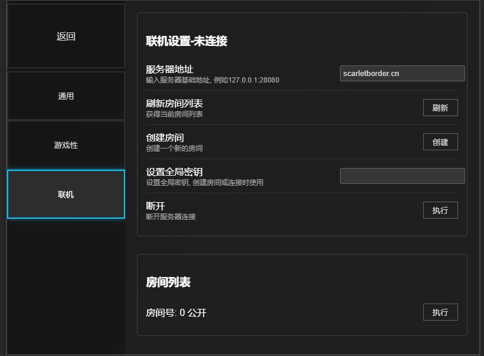
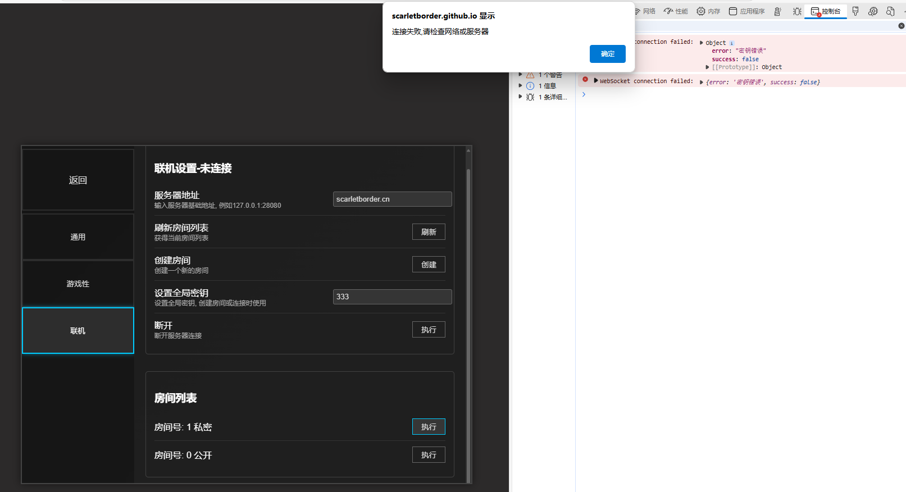
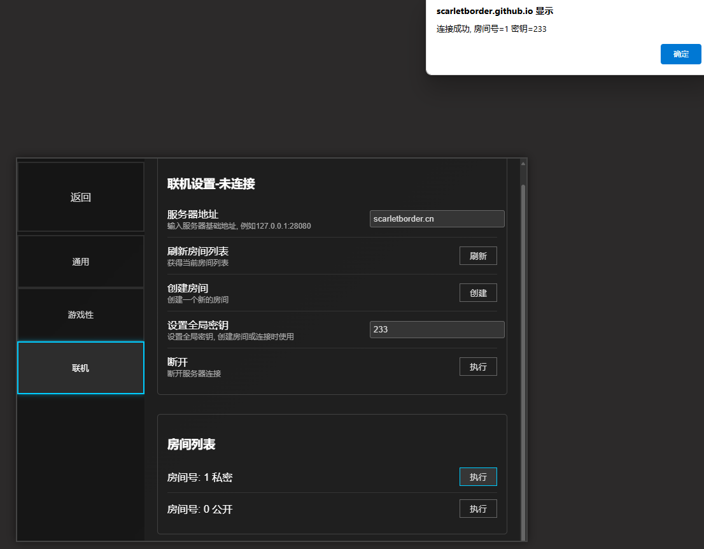

# 联机教程 cooperation mode tutorial

## 连接公益服务器

在服务器地址输入联机服务器地基础地址. 目前有一台部署在美国洛杉矶地公益服务器,地址为 `scarletborder.cn`,直接填写即可. 点击刷新即可查看

> [!WARNING]
>
> 公益服务器的延时较大,可能出现游戏中卡顿地现象可以考虑使用美国地区的加速器以提高体验.后续会考虑在亚洲购买公益服务器




### 设置房间密钥

在全局密钥输入框中输入你要设置的房间密码. 该密码会作为所有的创建房间和尝试连接房间的密码

如果密钥错误,那么连接私密房间时会显示连接错误,但其实问题在于密码错误,该问题后续会解决



成功连接如下



## 后续游戏

成功连接后,创建房间的用户选择关卡进入选择器械的界面后,客人用户会直接进入选择器械的界面.

## 自建服务端

[MVZ443/tools/server at main · scarletborder/MVZ443](https://github.com/scarletborder/MVZ443/tree/main/tools/server)

### 编译

```cmd
cd MVZ443/tools/server
go build
```

### 部署

```bash
./mvzserver -h

Usage of mvzserver:
  -c /etc/letsencrypt/live/scarletborder.cn
        启用自签名证书,例如 /etc/letsencrypt/live/scarletborder.cn
  -p int
        指定监听端口 (default 28080)
  -s    启用通过 Let's Encrypt 自动管理证书
```

本地开服使用`./mvzserver`就行了, 连接地址使用`127.0.0.1:28080`(或者`你的局域网地址:28080`)


部署到服务器使用 

```bash
certbot certonly

# 根据操作进行获取证书

./mvzserver -c /etc/letsencrypt/live/scarletborder.cn
```
