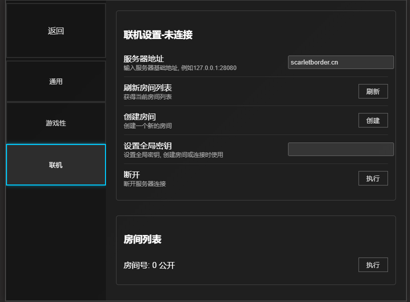
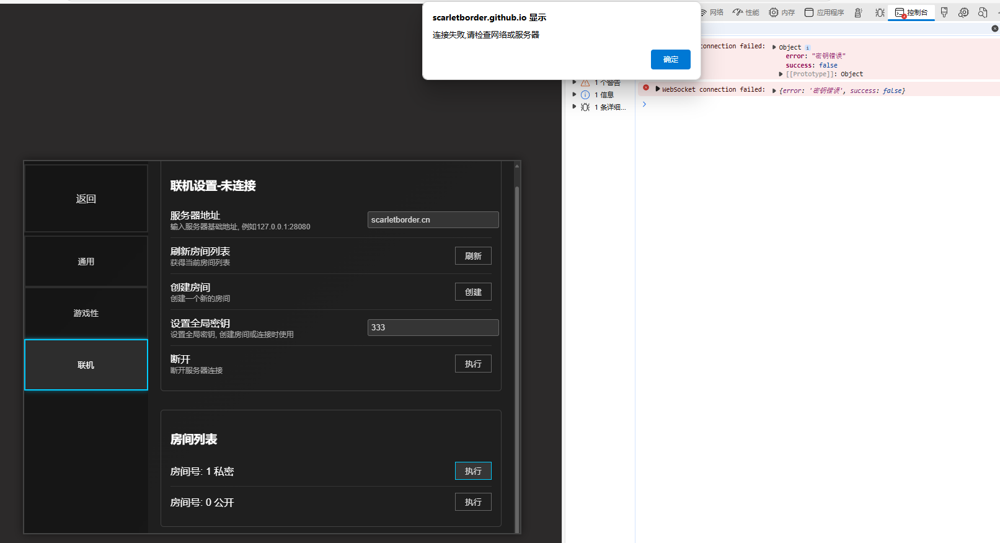

# 联机教程 cooperation mode tutorial

目前联机机制要求所有用户采用同一分辨率.

每次游戏结束都需要重新创建房间

## 连接公益服务器

在服务器地址输入联机服务器地基础地址. 目前有一台部署在美国洛杉矶地和一台部署在枣庄的公益云服务器,将域名填写进服务器地址输入框 点击刷新即可查看

- 山东枣庄(推荐)  `103.228.12.180:49870`
- 美国洛杉矶  `scarletborder.cn`

> [!WARNING]
>
> 美国公益服务器的延时较大,可能出现游戏中卡顿地现象可以考虑使用美国地区的加速器以提高体验.




## 证书问题

由于部分公益服务器为了节省成本用的是nat云,这种情况无法申请免费的https证书,因此使用了自建证书,这种情况下不能被浏览器信任,因此需要手动进行信任证书.

具体而言,浏览器前往`https://域名/list`例如 `https://103.228.12.180:49870/list`. 同时忽略风险继续访问,此时浏览器已经信任该证书.回到游戏中即可刷新房间列表或进入创建房间.

### 设置房间密钥

在全局密钥输入框中输入你要设置的房间密码. 该密码会作为所有的创建房间和尝试连接房间的密码

如果密钥错误,那么连接私密房间时会显示连接错误,但其实问题在于密码错误,该问题后续会解决



成功连接如下


## 后续游戏

成功连接后,创建房间的用户选择关卡进入选择器械的界面后,客人用户会直接进入选择器械的界面.

## 自建服务端

[MVZ443/tools/server at main · scarletborder/MVZ443](https://github.com/scarletborder/MVZ443/tree/main/tools/server)

### 编译

```cmd
cd MVZ443/tools/server
go build
```

### 部署

```bash
./mvzserver -h

Usage of mvzserver:
  -c /etc/letsencrypt/live/scarletborder.cn
        启用自签名证书,例如 /etc/letsencrypt/live/scarletborder.cn
  -p int
        指定监听端口 (default 28080)
  -s    启用通过 Let's Encrypt 自动管理证书
```

本地开服使用`./mvzserver`就行了, 连接地址使用`127.0.0.1:28080`(或者`你的局域网地址:28080`)


部署到服务器使用

#### 如果有独立IP 

```bash
certbot certonly

# 根据操作进行获取证书

./mvzserver -c /etc/letsencrypt/live/scarletborder.cn
```

#### 如果没有独立IP

```bash
./mvzserver -p 28080 #这里28080可以是你可以开放的端口
```

这种情况下,客户端需要手动信任证书
