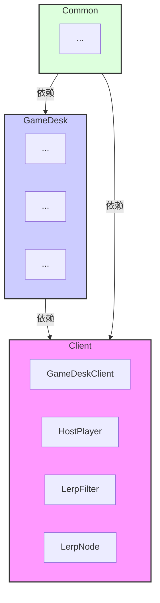
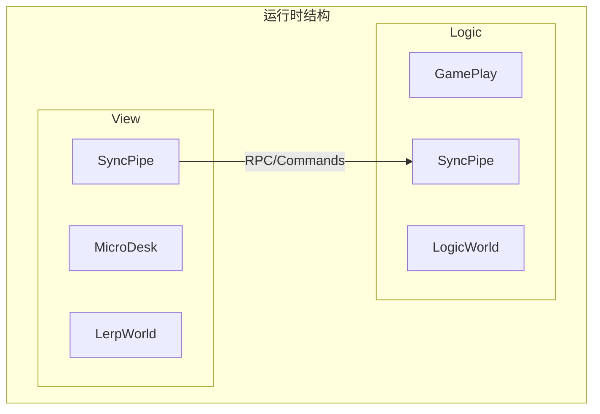
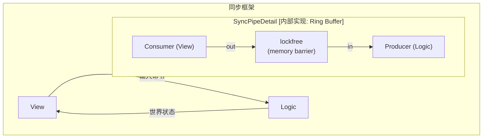
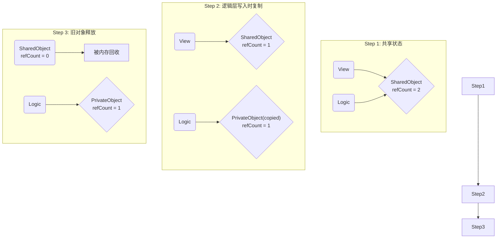
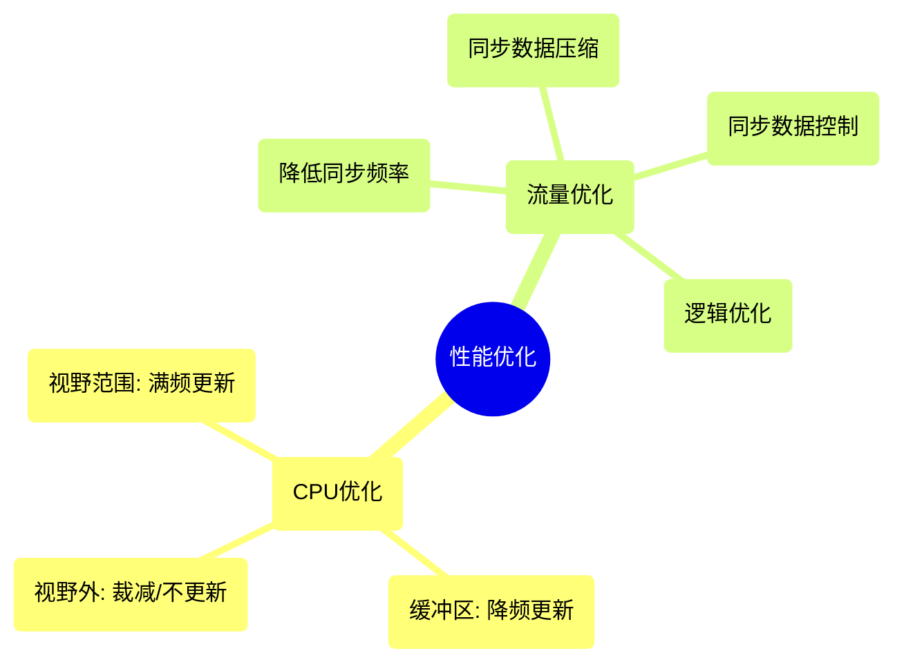
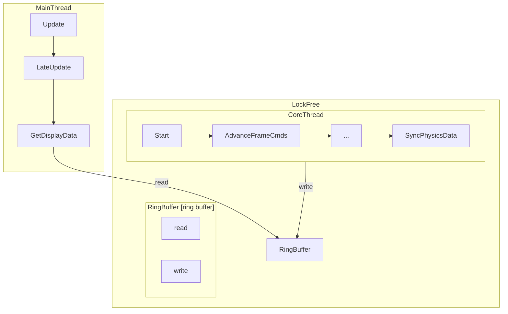
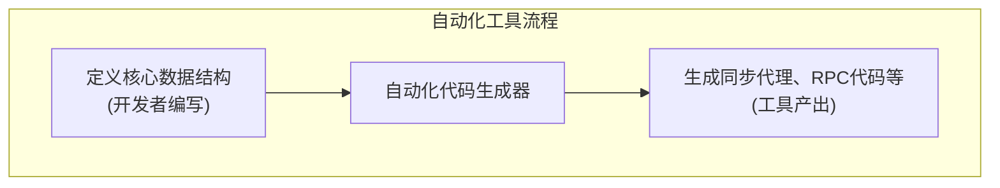

# 白皮书：LockFree物理同步——从耦合到并行，一套高性能实时同步架构的演进与实现

## 摘要

本文完整记录了一套高性能实时物理同步框架从问题识别、架构重构、核心技术实现到最终优化和成果验证的全过程。该框架旨在解决传统游戏同步方案中普遍存在的网络延迟体感和性能瓶颈问题。通过引入**逻辑与表现的彻底分离**、**基于无锁环形缓冲区的异步通信**、**客户端预测与回滚**以及**全方位的自动化与优化**策略，我们成功构建了一个既能保证多端状态最终一致性，又能为玩家提供接近单机游戏“零延迟”体验的现代化同步解决方案。

---

## 第一章：现状与挑战 —— 耦合的旧世界

任何成功的重构都始于对现有问题的深刻理解。我们的起点是一个功能完备但架构上存在严重隐患的物理同步系统。

### 1.1 初始架构分层
系统在宏观上分为三个层次：
*   **Client (表现层)**：负责所有与玩家视觉和交互相关的逻辑，如角色控制（HostPlayer）、UI通知（Notify/Request）以及用于平滑画面过渡的插值逻辑（Lerp）。
*   **GameDesk (逻辑层)**：系统的核心，包含了所有游戏玩法的核心逻辑和物理状态计算。
*   **Common (通用层)**：为上层提供基础工具，如基础容器、数学库、反射机制和内存池。

### 1.2 已达成的特性与尖锐的问题
这套旧架构已经实现了一些关键特性，如**帧命令驱动** , **跨平台能力** ， **自定义内存管理** 和**录像回放**功能。然而，其成功之下掩盖了致命的设计缺陷：

*   **问题1：严重耦合**
    *   表现层（Client）中的插值逻辑（Lerp）为了平滑地展示物理世界，需要频繁、直接地访问逻辑层（GameDesk）的内部数据和状态。
    *   如下图所示，这种依赖关系是单向但极其沉重的，表现层对逻辑层存在大量依赖。

*   **问题2：无法并行**
    *   耦合的直接后果是，`MainThread`（负责表现层）在渲染每一帧时，必须等待`CoreThread`（负责逻辑层）计算完成，甚至可能需要进行同步调用，导致两者无法真正并行，严重浪费了现代多核CPU的性能。

*   **问题3：维护效率低下**
    *   表现层存在多套相似的插值逻辑，增加了开发和维护的复杂度。
    *   逻辑层内部也因边界不清，模块间耦合日益增多，逐渐演变成一个难以维护的“大泥球”。



---

## 第二章：新架构蓝图 —— 解耦与并行的哲学

为了解决上述问题，我们提出了一套全新的框架设计，其核心思想是**彻底解耦**和**拥抱并行**。

### 2.1 兼容多模式的高性能架构
新架构将游戏逻辑清晰地划分为**前端（表现层）**和**后端（逻辑层）**，两者之间通过一个抽象的**同步管道（SyncPipe）**进行通信。

| 模块 | 职责 |
| :--- | :--- |
| **交互端/引擎** | 负责最基础的输入采集和最终画面的呈现。 |
| **逻辑前端/表现层 (View)** | 仅负责游戏表现层模拟，不关心任何逻辑层细节。 |
| **同步管道 (SyncPipe)** | 链接前后端的桥梁，支持跨线程、跨网络通信。 |
| **逻辑后端/逻辑层 (Logic)** | 仅负责游戏逻辑和物理运算，不关心任何表现层细节，可独立运行在客户端或服务器。 |
| **物理逻辑层 (Physics)** | 从原逻辑层中剥离，可被前后端独立调用，支持多实例和多线程。 |


### 2.2 整体运行时结构
在运行时，`View`和`Logic`作为两个独立的单元，通过`SyncPipe`异步通信。它们可以共享不可变数据（SharedMemory），但各自拥有独立的私有内存（PrivateMemory），确保了高度的独立性。



---

## 第三章：核心技术实现

本章将深入探讨实现新架构所依赖的核心技术。

### 3.1 跨线程/跨网络同步框架：无锁管道
`SyncPipe`是新架构的心脏。它是一个基于**命令模式（Command Pattern）**和**RPC**思想的框架，其底层实现为**无锁环形缓冲区（Lock-Free Ring Buffer）**。

**工作原理：**
*   **生产者-消费者模型**: `Logic`作为生产者，将计算好的权威状态或命令写入缓冲区。`View`作为消费者，从中读取数据用于渲染和预测。
*   **无锁（Lock-Free）**: 通过**原子操作**和**内存屏障**来管理读写指针，避免了使用互斥锁（Mutex）带来的线程阻塞和性能开销。
*   **单向数据流**: `View`向`Logic`发送输入命令（RPC），`Logic`向`View`同步世界状态，数据流清晰可控。



**Go语言演示：使用Channel模拟无锁管道**
在Go中，一个带缓冲的大小为1的`channel`可以完美地模拟单生产者、单消费者的无锁管道行为。

```go
// syncPipe 是连接 LogicGoroutine 和 RenderGoroutine 的桥梁。
// LogicGoroutine 是唯一的生产者, RenderGoroutine 是唯一的消费者。
// 大小为1的缓冲确保了最新的状态可以被写入而不会阻塞生产者，
// 同时允许消费者非阻塞地尝试读取。
syncPipe := make(chan *WorldState, 1)

// 生产者 (LogicGoroutine) 写入:
// 这种"select-default"模式实现了非阻塞写入，如果管道已满，则先丢弃旧的，再放入新的。
select {
case syncPipe <- authoritativeState.Copy(): // 尝试写入
default:
    <-syncPipe // 丢弃旧数据
    syncPipe <- authoritativeState.Copy() // 写入新数据
}

// 消费者 (RenderGoroutine) 读取:
// 这种模式实现了非阻塞读取，如果管道为空，则不等待，继续使用上一份数据。
select {
case receivedState := <-syncPipe:
    lastAuthoritativeState = receivedState
default:
    // 管道为空，不阻塞，继续执行
}
```

### 3.2 并行支持与数据管理
在并行环境中，必须小心处理数据访问。

*   **数据分类**:
    *   **unshared**: 线程私有数据，不存在并发问题。
    *   **shared**: 共享数据，由`Logic`创建和销毁。
        *   **immutable (不可变)**: 创建后即不可修改，多线程安全读取。
        *   **mutable (可变)**: 可能被修改，但频率很低。采用**写时复制（Copy on Write）**结合**引用计数（Reference Count）**来管理。

**写时复制（Copy on Write）工作流：**



*   **线程私有内存池**: 为避免在多线程环境下对内存池的竞争，我们为每个核心线程（`Logic`和`View`）分配了各自私有的内存池。通过**线程局部存储（TLS）**和`ActiveContextRouter`来确保每个线程都从正确的内存池中分配和释放内存。

### 3.3 延迟处理：客户端预测与回滚
这是提升玩家响应体验的核心技术，也被称为**Run-Ahead**。

1.  **预测执行**: `View`在渲染每一帧时，不等服务器的权威结果，而是勇敢地使用**本地刚刚采集的最新输入**，结合已知的上一个权威状态，来**预测**并**渲染**下一帧的画面。
2.  **回滚与修正**: 当`Logic`线程接收到服务器下发的、包含了该帧真实输入的权威命令后，会计算出真正的权威状态。`View`线程在拿到这个新的权威状态后，会用它来覆盖自己之前的预测。
    *   **如果预测正确**，画面平滑过渡。
    *   **如果预测错误**（Misprediction），画面会在一帧之内被“拉回”到正确的位置。这个瞬间的修正常常不易察觉，但玩家的操作却得到了即时反馈。

**Go语言演示：预测逻辑**

```go
// predictNextState 实现了客户端预测逻辑
func predictNextState(baseState *WorldState, localClientID int, localInput PlayerInput) *WorldState {
    // 关键：基于权威状态的副本进行预测
    predictedState := baseState.Copy()
    predictedState.FrameID++ // 预测的是下一帧

    // 关键点：对于本地玩家，我们使用刚刚采集的最新输入！
    // 对于其他玩家，我们只能猜测（例如，使用他们上一帧的输入）。
    simulatedCmd := FrameCommand{
        Inputs: map[int]PlayerInput{
            localClientID: localInput,
            // ...其他玩家的推测输入
        },
    }

    // 在预测状态上，跑一遍完全相同的确定性逻辑
    applyLogic(predictedState, &simulatedCmd)
    return predictedState
}
```

---

## 第四章：系统实现与全景代码

本章展示了完整的服务器和客户端实现。

### 4.1 权威服务器实现
服务器逻辑简单、轻量，只负责收集输入、打包广播。

```go
// runServer 模拟了权威服务器的完整生命周期
func runServer(ctx context.Context, inputChan <-chan struct {
	ClientID int
	Input    PlayerInput
}, broadcastChans map[int]chan FrameCommand) {
    ticker := time.NewTicker(ServerTickRate)
    defer ticker.Stop()
    var frameID int
    pendingInputs := make(map[int]PlayerInput)

    for {
        // ... (接收、聚合输入)
        select {
        case <-ticker.C:
            cmd := FrameCommand{ FrameID: frameID, Inputs: pendingInputs }
            // 广播帧命令，并模拟网络延迟
            for _, clientChan := range broadcastChans {
                go func(c chan FrameCommand, command FrameCommand) {
                    // ... 模拟延迟 ...
                    c <- command
                }(clientChan, cmd)
            }
            frameID++
            pendingInputs = make(map[int]PlayerInput) // Reset for next frame
        }
    }
}
```

### 4.2 客户端双线程（Goroutine）实现
客户端是架构的核心，由`logicGoroutine`和`renderGoroutine`组成。

*   **`logicGoroutine` (CoreThread)**: 严格按照服务器剧本演进世界，并将权威状态写入`syncPipe`。
*   **`renderGoroutine` (MainThread)**: 以高帧率运行，采集输入、从`syncPipe`读取最新权威状态、执行预测并渲染。

```go
// 客户端启动入口
func runClient(ctx context.Context, clientID int, /*...channels...*/) {
    syncPipe := make(chan *WorldState, 1) // 创建核心管道
    go logicGoroutine(ctx, clientID, broadcastChan, syncPipe)
    go renderGoroutine(ctx, clientID, serverInputChan, syncPipe)
    // ... 等待结束 ...
}

// logicGoroutine
func logicGoroutine(/*...args...*/) {
    authoritativeState := &WorldState{ /* ... */ }
    for {
        cmd := <-broadcastChan // 阻塞等待服务器指令
        applyLogic(authoritativeState, &cmd) // 执行确定性逻辑
        // 写入syncPipe
        select {
        case syncPipe <- authoritativeState.Copy():
        default:
            <-syncPipe
            syncPipe <- authoritativeState.Copy()
        }
    }
}

// renderGoroutine
func renderGoroutine(/*...args...*/) {
    ticker := time.NewTicker(ClientRenderRate)
    var lastAuthoritativeState *WorldState
    for range ticker.C {
        // 1. 采集本地输入并上报
        localInput := collectInput()
        serverInputChan <- localInput

        // 2. 非阻塞读取权威状态
        select {
        case receivedState := <-syncPipe:
            lastAuthoritativeState = receivedState
        default: // no-op
        }

        // 3. 执行预测
        predictedState := predictNextState(lastAuthoritativeState, clientID, localInput)

        // 4. 渲染预测画面
        render(predictedState)
    }
}```

*(完整的、可运行的Go代码请参考前文的最终代码演示)*

---

## 第五章：优化、成果与开发流程

### 5.1 性能优化
*   **CPU优化**: 引入**视野裁减**和**降频更新**策略。对视野范围内的实体满频更新，对视野外的实体根据距离进行降频更新或完全不更新，大幅节省CPU资源。
*   **流量优化**: 通过差异同步、数据压缩、合并命令、按需同步字段等多种手段，显著降低网络带宽占用。



### 5.2 成果与验证
重构后，系统的核心性能指标得到了质的飞跃。

*   **同步耗时大幅降低**: `GetDisplayData`的耗时下降了 **75%** 以上。这得益于`Logic`和`View`的彻底并行，`View`不再需要等待`Logic`。
*   **初步成果图示**:



### 5.3 开发流程与工具链
为保障大规模重构的顺利进行和后续开发的效率，我们建立了完善的流程和工具。

*   **核心逻辑改造**: 将庞大的`GameDesk`拆分为独立的`Gameplay`、`Physics`和`Interface`三层，实现了边界清晰和单向依赖。
*   **自动化一致性验证**: 建立CI/CD流水线，通过运行录制的输入文件，对比改造前后两个版本的输出，确保逻辑的100%一致性，极大地降低了重构风险。
*   **代码自动化工具**: 开发了代码生成器，开发者只需定义数据结构，工具即可自动生成所有同步、序列化和RPC相关的模板代码，大幅提升了开发效率。



---

## 第六章：结论

本文详细阐述了一套“LockFree物理同步”架构的完整演进历程。我们从一个存在严重耦合问题的传统架构出发，通过引入**逻辑与表现分离**、**无锁通信**和**客户端预测**三大核心理念，成功地解决了性能瓶颈和操作延迟问题。

最终交付的架构，不仅在性能和玩家体验上取得了突破性进展，更通过**分层重构、自动化工具链**和**完善的验证流程**，建立了一个清晰、健壮、高效、易于维护的开发范式。这套方案证明了，在实时同步领域，通过精巧的架构设计，完全可以同时实现**严格的一致性**和**极致的响应性**。